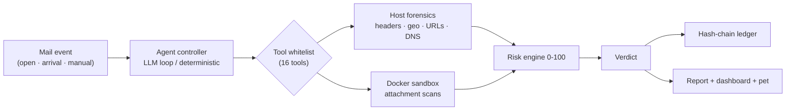

# 🛡️ Sentinel — AI-Powered Cybersecurity Agent

**Email threat detection · geolocation tracing · forensic analysis · blockchain-verified evidence logging** — all local, all terminal-native, no web dashboard.

[](https://www.python.org/)
[](LICENSE)
[](https://github.com/17krishna8/project/actions)
[](#)

Sentinel investigates **one `.eml` at a time** using a **local LLM (Ollama)** as
the reasoning brain, a **tool-whitelisted** Python agent controller, a
**Docker sandbox** for static file analysis, and a **hash-chained blockchain
ledger** for tamper-proof evidence.

It uniquely combines three pillars no free/open tool combines:

| 🤖 AI | 🛡️ Cybersecurity | 🔗 Blockchain |
|---|---|---|
| Ensemble, multi-signal judgment | 16 forensic tools + sandbox | Tamper-evident evidence log |

And it honestly solves the classic **Gmail/webmail-hides-sender-IP** problem —
with confidence-scored fallbacks instead of fake pins.

---


---

## The desktop pet

A Comnyang-style **pixel-art guard** that lives **static** on your desktop
(pinned to your Gmail window corner by default — it never wanders, only its
face animates). It mirrors the agent's live state and adds chat, mail display,
analysis, and notifications.


**Expressions** change with state/risk: `idle` → `investigating` → `thinking`
(… bubble) → `tool_running` → `confirm_needed` (! bubble) → `verdict`
(green happy hop / red alarm + shake), plus `talking`, `sleepy`, `celebrate`,
`confused`. Body color tracks the live risk score (green→yellow→orange→red).

```bash
pip install PySide6
python -m overlay.sentinel_pet --demo          # cycle all expressions
python -m overlay.sentinel_pet --mail mailpit  # static pet + mail panel + chat
```

- **Chat** — click the pet, type, it answers via your local Ollama in a speech bubble.
- **Mail** — self-hosted **Mailpit** inbox (demo), screen-OCR, or a read-only
  Gmail OAuth stub (`sentinel/mail.py`).
- **Notifications** — OS-native toasts on new verdicts/mail.
- **Activate-on-open** — the agent wakes only when you *open* a mail: via the
  bundled browser extension (full forensics) or the Windows title watcher
  (surface analysis, confidence-capped). See [docs/WATCHER.md](docs/WATCHER.md).

---

## Quick start

```bash
bash setup.sh                       # venv + deps (+ optional sandbox/Ollama)
source .venv/bin/activate

python run.py samples/phishing.eml   # full investigation (LLM, offline fallback)
python run.py samples/bec_gmail.eml --no-llm
python run.py --verify-chain         # prove the evidence ledger was never altered
```

Sample `.eml` fixtures in [`samples/`](samples/):

| File | Scenario | Expected |
|---|---|---|
| `clean.eml` | legitimate internal mail | SAFE |
| `phishing.eml` | brand-impersonating phish | MALICIOUS |
| `bec_gmail.eml` | BEC via Gmail webmail (IP hidden) | SUSPICIOUS |
| `malware_attachment.eml` | ELF binary disguised as `.pdf` | MALICIOUS |

---

## The 16 whitelisted tools

| Tool | Runs in | Purpose |
|---|---|---|
| `hash_evidence` | host | SHA-256 before analysis (evidence anchor) |
| `parse_headers` | host | all `Received:` hops, SPF/DKIM |
| `resolve_origin` | host | true sender IP + Gmail-hiding fallback |
| `geolocate_ip` | host | multi-source geo with confidence radius |
| `check_tor_exit` | host | Tor exit-node DNSEL check |
| `extract_urls` | host | typosquat / brand-mismatch detection |
| `check_reputation` | host | VirusTotal + AbuseIPDB |
| `dns_lookup`, `whois_lookup` | host | phishing-infrastructure tracing |
| `static_file_scan` | **sandbox** | exiftool + oletools + entropy |
| `binwalk_scan` | **sandbox** | embedded-file carving |
| `pdfid_scan` | **sandbox** | PDF exploit detection |
| `capa_scan` | **sandbox** | FLARE capability detection (ATT&CK) |
| `strings_scan` | **sandbox** | URLs/IPs/shell-command strings |
| `yara_scan` | **sandbox** | signature matching |
| `pecheck_scan` | **sandbox** | PE structural anomalies |

The 7 sandboxed tools map to real **Parrot OS / REMnux** binaries, pinned
inside a network-isolated container (`sandbox/Dockerfile`), each behind a
human `[CONFIRM_NEEDED]` gate.

---

## Safety measures (enforced in code)

1. **Tool whitelist** — the LLM only *names* tools; no `eval`/`exec`/shell.
2. **Docker sandbox** — `--network none`, read-only, `--cap-drop ALL`,
   non-root, destroyed per run.
3. **Static analysis only** — attachments are never executed.
4. **Confirmation gate** — file-touching tools wait for a human `yes`.
5. **Hard timeouts** — 15s per tool call.
6. **Immutable evidence** — hash before analysis; `--verify-chain` detects tampering.
7. **Prompt-injection defense** — email content in `<EMAIL_DATA>` tags.
8. **Kill-switch** — `q` / `x` / `ESC` aborts instantly.

See [SECURITY.md](SECURITY.md) for the full security model and reporting policy.

---

## Configuration

Copy [`.env.example`](.env.example) → `.env`. Everything has a safe local
default; the only *optional* cloud bits are free-tier reputation APIs:

| Variable | Purpose |
|---|---|
| `LLM_PROVIDER` | `ollama` (default, local) or `openai` — any OpenAI-compatible `/chat/completions` endpoint |
| `OPENAI_BASE_URL` / `OPENAI_API_KEY` / `OPENAI_MODEL` | provider settings used when `LLM_PROVIDER=openai` |
| `OLLAMA_MODEL` | local model (`llama3.1:8b`, `qwen2.5:7b`, `qwen2.5:14b`) |
| `VIRUSTOTAL_API_KEY` / `ABUSEIPDB_API_KEY` | reputation lookups |
| `MAXMIND_GEOLITE2_PATH` | offline GeoIP cross-validation |
| `BLOCKCHAIN_MODE` | `hashchain` (default) or `ganache` |

---

## Project layout

```
run.py                     entry point
sentinel/                  agent + tools + blockchain (see docs/ARCHITECTURE.md)
sandbox/                   Dockerfile + yara_rules/
overlay/                   sandbox scripts + desktop pet + diagram/preview renderers
docs/                      architecture doc + diagrams
samples/                   .eml test fixtures
tests/                     offline test suite (14 tests)
```

## Architecture at a glance



Full data flow and component diagrams: [`docs/ARCHITECTURE.md`](docs/ARCHITECTURE.md).

## Development

```bash
pip install -r requirements-dev.txt
python -m pytest          # runs offline — no Docker/Ollama/network needed
```

See [CONTRIBUTING.md](CONTRIBUTING.md) to add a tool, rule, or pet feature.

## License

[MIT](LICENSE) · [Changelog](CHANGELOG.md) · [Code of Conduct](CODE_OF_CONDUCT.md)
