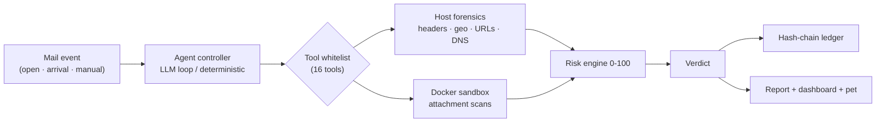

<div align="center">

# 🛡️ Sentinel

### AI-Powered Email Threat Detection, GeoLocation & Forensic Intelligence Platform

**Local-first · LLM reasoning · 16 forensic tools · Tamper-proof evidence ledger · Event-driven activation**

[](https://github.com/Jyothika30-2006/Sentinel/actions/workflows/ci.yml)
[](#-testing--safety)
[](https://www.python.org/)
[](LICENSE)
[](#-why-sentinel-is-different)
[](CONTRIBUTING.md)

[Quick Start](#-quick-start) · [Architecture](#-architecture) · [Features](#-what-it-does) · [Live Demo](#-live-demo) · [Docs](#-documentation)

</div>

---

## 📖 Jump to section

- [What it does](#-what-it-does)
- [Why Sentinel is different](#-why-sentinel-is-different)
- [Architecture](#-architecture)
- [Quick start](#-quick-start)
- [Live demo](#-live-demo)
- [Testing & safety](#-testing--safety)
- [Documentation](#-documentation)
- [Project layout](#-project-layout)

<details>
<summary><b>🎯 The problem (click to expand)</b></summary>

Email attacks are still investigated by humans **manually**: reading headers hop by hop, chasing sender IPs, opening links one by one, sandboxing attachments by hand. Three things make that painful:

1. **Evidence is scattered** — headers, links, attachments, DNS records live in different places.
2. **Attackers hide** — spoofed senders, relays that strip the real IP, typosquatted domains.
3. **Nobody can prove later** what the evidence actually was.

> Sentinel attacks all three at once — automatically, locally, and provably.

</details>

---

## 🧭 What it does

Sentinel investigates **one email at a time**, end to end:

```
📧 mail event ──▶ 🔍 16 forensic tools ──▶ 🧮 explainable risk 0–100
              ──▶ ⚖️ verdict + plain-English story ──▶ 🔗 tamper-proof ledger + report
```

| Pillar | What it contributes |
|---|---|
| 🤖 **AI** | A tool-calling LLM investigates like a human analyst — chooses tools, updates a live risk score with written justification, delivers the verdict. Local Ollama **or** any OpenAI-compatible endpoint, with a deterministic no-LLM fallback. |
| 🛡️ **Cybersecurity** | 16 whitelisted forensic tools: header/SPF/DKIM analysis, true-sender tracing behind Gmail relays, multi-source geolocation, Tor detection, URL typosquat & brand-mismatch analysis, VirusTotal/AbuseIPDB reputation, DNS/WHOIS, and 7 sandboxed attachment scanners. |
| 🔗 **Blockchain** | Every verdict is hash-chained into `evidence/ledger.chain.json` — modify one character anywhere and verification pinpoints the tampering. |

<details>
<summary><b>🧰 The 16 whitelisted tools (click to expand)</b></summary>

**Host-side (9)** — instant, local:

| Tool | Purpose |
|---|---|
| `hash_evidence` | SHA-256 evidence anchor before analysis |
| `parse_headers` | All `Received:` hops, SPF / DKIM / DMARC |
| `resolve_origin` | True sender IP behind Gmail/Outlook relays |
| `geolocate_ip` | Multi-source geo with confidence radius |
| `check_tor_exit` | Tor DNSEL check |
| `extract_urls` | Typosquat, brand mismatch, punycode |
| `check_reputation` | VirusTotal + AbuseIPDB |
| `dns_lookup` / `whois_lookup` | Phishing-infrastructure tracing |

**Sandbox-side (7)** — Docker: no network, read-only, non-root, destroyed per run:

`static_file_scan` (exiftool/oletools/entropy) · `binwalk_scan` · `pdfid_scan` · `capa_scan` · `strings_scan` · `yara_scan` · `pecheck_scan`

</details>

---

## ⭐ Why Sentinel is different

<details open>
<summary><b>⚡ Event-driven activation — the agent wakes only when it matters</b></summary>

Traditional scanners ingest everything: privacy nightmare, alert fatigue, cost. Sentinel's contract:

| Trigger | How it works |
|---|---|
| 🧩 **Browser extension** | You **open** a Gmail thread (or new mail **arrives**) → connector posts the full source to the local agent → verdict chip inside Gmail |
| 📬 **Mailpit arrival watcher** | Local SMTP catcher — new mail auto-triaged in ~3 seconds |
| 🪟 **Title watcher** (Windows) | Foreground tab becomes `«Subject» - … - Gmail` → surface analysis, confidence honestly capped |
| 🖱️ **Manual** | Dashboard upload, sample cases, CLI, pet menu |

> **Never scans on timers · never sweeps inboxes · never sends mail to any cloud.**
> Full detail: [`docs/WATCHER.md`](docs/WATCHER.md)

</details>

<details>
<summary><b>🗣️ Honest confidence — it never fabricates certainty</b></summary>

When a sender IP is hidden behind Gmail relays, most tools fake a location. Sentinel refuses:

```
Sender IP unrecoverable (Gmail/Outlook webmail relay only).
No precise location will be asserted. Confidence lowered to 15%.
```

Same for surface-only triggers (no account access): verdicts are labeled
`[surface analysis]` and confidence is **capped at 60%** — the system tells
you exactly what it could and could not verify.

</details>

---

## 🏗️ Architecture



<details>
<summary><b>🔁 The journey of one email (step by step)</b></summary>

1. **Mail event** — arrival or open — detected by a watcher
2. **Evidence hashed** (SHA-256) *before anything touches it*
3. **Headers dissected** — every `Received:` hop, SPF / DKIM / DMARC
4. **True sender hunted** — relay IPs skipped, `client-ip=` recovered
5. **Infrastructure interrogated** — geolocation, Tor check, DNS/WHOIS, reputation
6. **Links & attachments judged** — typosquats, punycode; sandbox scans, never executed
7. **Risk points accumulate** — "+25 SPF fail", "+30 PayPal impersonation" — every point explained
8. **Verdict lands** — SAFE / SUSPICIOUS / MALICIOUS + threat story + what/why/impact/action
9. **Sealed** — hash-chained ledger block + Markdown forensic report
10. **Humans see it instantly** — pet reacts, dashboard updates, Gmail chip, OS toast

</details>

---

## 🚀 Quick start

```bash
git clone https://github.com/Jyothika30-2006/Sentinel.git
cd Sentinel
bash setup.sh            # venv + dependencies
source .venv/bin/activate   # Windows: .venv\Scripts\activate

python run.py samples/phishing.eml        # CLI investigation (LLM or fallback)
python run.py --verify-chain              # prove the evidence ledger is intact
python run_guard.py                       # full experience: server + pet + watchers
```

<details>
<summary><b>⚙️ Configuration (click to expand)</b></summary>

Copy [`.env.example`](.env.example) → `.env`. Everything has a safe local default:

| Variable | Purpose |
|---|---|
| `LLM_PROVIDER` | `ollama` (default, local) or `openai` — any OpenAI-compatible endpoint |
| `OLLAMA_MODEL` | `llama3.1:8b`, `qwen2.5:7b`, `qwen2.5:14b` (tool-calling capable) |
| `OPENAI_BASE_URL` / `OPENAI_API_KEY` / `OPENAI_MODEL` | for `LLM_PROVIDER=openai` |
| `VIRUSTOTAL_API_KEY` / `ABUSEIPDB_API_KEY` | optional reputation lookups |
| `BLOCKCHAIN_MODE` | `hashchain` (default) or `ganache` |
| `SANDBOX_ENABLED` / `TOOL_TIMEOUT_SECONDS` | safety controls |

Optional: Docker (sandbox isolation) · Mailpit (`tools/mailpit`, demo inbox) ·
the browser extension in `extension/` (load unpacked) for Gmail activation.

</details>

<details>
<summary><b>🖥️ Four ways to use it</b></summary>

| Interface | Launch | What you get |
|---|---|---|
| **CLI** | `python run.py samples/phishing.eml` | Live risk gauge, AI reasoning, report |
| **Dashboard** | `python app.py` → `127.0.0.1:5000` | KPIs, charts, investigations, ledger, Copilot |
| **Desktop pet** | `python run_guard.py` | Floating guardian mirroring the agent live |
| **REST API** | same server | `/api/analyze`, `/api/ledger`, `/api/copilot/chat`, … |

</details>

---

## 🎬 Live demo

```bash
# 1. a real phishing email, investigated end-to-end
python run.py samples/phishing.eml

# 2. a business-email-compromise attempt with a hidden sender IP
python run.py samples/bec_gmail.eml

# 3. prove the evidence ledger was never altered
python run.py --verify-chain
```

Sample outcomes: `clean.eml` → **SAFE** · `phishing.eml` → **MALICIOUS (85/100)**
· `bec_gmail.eml` → **SUSPICIOUS** · `malware_attachment.eml` → sandboxed ELF
disguised as `.pdf` → flagged.

Full presenter walkthrough: [`DEMO.md`](DEMO.md)

---

## 🧪 Testing & safety

```bash
pip install -r requirements-dev.txt
python -m pytest          # 82 tests — offline, no Docker/Ollama/network needed
```

Safety is **enforced in code**, not promised: the AI can only *name* whitelisted
tools · attachments are **never executed** · human confirmation gates file-touching
tools · 15 s tool timeouts · bounded agent loops · prompt-injection defense via
`<EMAIL_DATA>` tagging · kill-switch (`q` / `x` / ESC). See
[`SECURITY.md`](SECURITY.md).

---

## 📚 Documentation

| Doc | Contents |
|---|---|
| [`docs/ARCHITECTURE.md`](docs/ARCHITECTURE.md) | Full data flow + Mermaid component diagrams |
| [`docs/WATCHER.md`](docs/WATCHER.md) | The event-driven activation system (all tiers) |
| [`DEMO.md`](DEMO.md) | Presenter walkthrough |
| [`SECURITY.md`](SECURITY.md) | Security model & reporting policy |
| [`CONTRIBUTING.md`](CONTRIBUTING.md) | Add a tool, rule, or pet feature |

## 📁 Project layout

```
run.py / run_guard.py        CLI entry / unified launcher (server + pet + watchers)
app.py                       Flask dashboard + REST API
sentinel/                    agent · orchestrator · tools · sandbox · ledger · watchers
templates/index.html         the web dashboard
extension/                   Gmail browser connector
overlay/sentinel_pet.py      desktop pet companion
sandbox/                     Dockerfile + yara_rules
evidence/ledger.chain.json   the tamper-proof evidence chain (runtime)
reports/                     one forensic report per investigation (runtime)
```

---

<div align="center">

**Built for Smart India Hackathon 2026** — Problem Statement `SIH26106`
*AI-Powered Email Threat Detection, GeoLocation and Forensic Intelligence Platform*

⭐ Star this repo if you find it useful · 🐛 [Report an issue](../../issues) · [Contributing](CONTRIBUTING.md)

</div>
