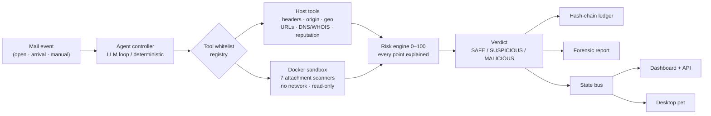
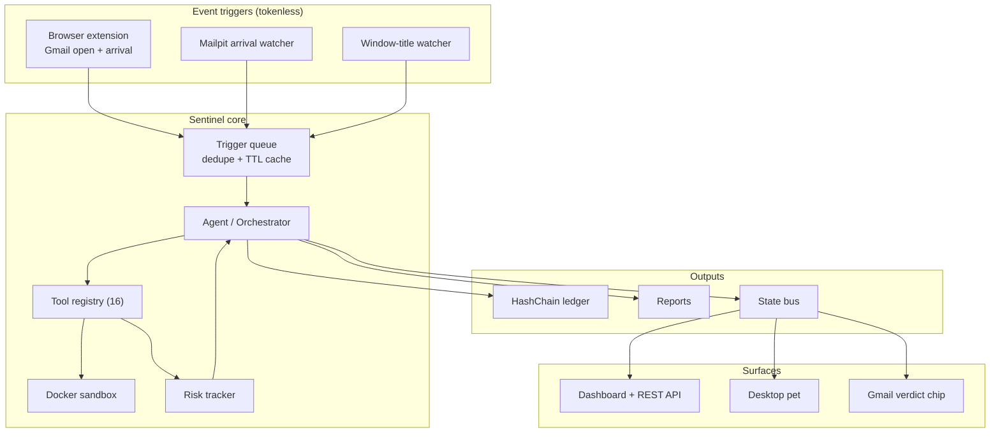

# Sentinel — Architecture & The Three Pillars

This document explains **how the project works** and how it maps to the
three required pillars: **AI**, **Cybersecurity**, and **Blockchain**.

---

## 1. The Three Pillars (what each one does)

| Pillar | Where it lives | What it contributes |
|---|---|---|
| **🤖 AI** | `sentinel/llm.py`, `sentinel/agent.py`, `sentinel/prompt.py` | A **local LLM (Ollama)** is the reasoning brain. It reads the email, decides *which tool to call next*, reads each result, updates the risk score, and writes the final verdict. It never runs code directly — it only *names* tools. |
| **🛡️ Cybersecurity** | `sentinel/tools/*`, `sentinel/sandbox.py`, `sandbox/Dockerfile` | The **whitelisted forensics tools** (header parsing, IP origin resolution, multi-source geolocation, Tor detection, URL/brand analysis, reputation lookup, static malware analysis) plus the **Docker sandbox** (network-restricted, read-only, destroyed per run) and the safety gates (confirmation, kill-switch, timeouts, prompt-injection defense). |
| **🔗 Blockchain** | `sentinel/blockchain/*` | A **tamper-evident evidence ledger**. Only `{file_hash, verdict, confidence, timestamp, geo_summary}` is logged — never the raw email. `hashchain` (pure-Python, default) or `ganache` (local Ethereum testnet) both give the same guarantee: mutate any record and verification fails. |

**Why this combination is the differentiator:** no free tool combines an AI
reasoning loop + multi-source confidence-scored geolocation + forensic-grade
immutable evidence logging. Each pillar covers a weakness of the others:

- **AI** turns "one rule" into *ensemble, multi-signal* judgment.
- **Cybersecurity tooling** gives the AI *real evidence* instead of guesses.
- **Blockchain** makes the *final verdict auditable* — proving later that
  neither the evidence nor the verdict was altered.

---

## 2. Working architecture (data flow)

```
                    ┌─────────────────────────────────────────────┐
                    │            YOU (terminal operator)          │
                    │   python run.py samples/phishing.eml        │
                    └──────────────────────┬──────────────────────┘
                                           │  (1) .eml path
                                           ▼
┌──────────────────────────────────────────────────────────────────────────┐
│                        AGENT CONTROLLER                                  │
│              sentinel/agent.py  +  sentinel/main.py                      │
│                                                                          │
│   THINK ──► CHOOSE TOOL ──► ACT ──► OBSERVE ──► UPDATE RISK ──► REPEAT  │
│                                                                          │
│   ┌────────────────────┐    tool names only (no code, no shell)          │
│   │  LOCAL LLM (Ollama)│─────────────────────────────┐                   │
│   │  llama3.1 / qwen2.5│                             │                   │
│   └────────────────────┘                             ▼                   │
│        ▲  observations (JSON)        ┌──────────────────────────────┐    │
│        └─────────────────────────────│  TOOL WHITELIST (registry.py)│    │
│                                      │  name ──► function (8 tools) │    │
│                                      └──────────────┬───────────────┘    │
│                                                     │                     │
│        ┌──────────────────┬─────────────────────────┼─────────────────┐   │
│        ▼                  ▼                         ▼                 ▼   │
│  pure-Python        network tools           file-touching       evidence   │
│  parse_headers      geolocate_ip            (static_file_scan)  hash_evid. │
│  resolve_origin     check_tor_exit                 │                 │    │
│  extract_urls       check_reputation               │                 │    │
│        │                  │                        ▼                 │    │
│        │                  │          ┌──────────────────────────┐   │    │
│        │                  │          │      DOCKER SANDBOX      │   │    │
│        │                  │          │  --network none          │   │    │
│        │                  │          │  --read-only mount       │   │    │
│        │                  │          │  --cap-drop ALL, non-root│   │    │
│        │                  │          │  exiftool/oletools/...   │   │    │
│        │                  │          │  destroyed after run     │   │    │
│        │                  │          └──────────┬───────────────┘   │    │
│        │                  │                     │  JSON result      │    │
│        └──────────────────┴─────────────────────┘                    │    │
│                             │ every result updates                   │    │
│                             ▼  RISK SCORE (0-100)                    │    │
│              ┌────────────────────────────────────┐                  │    │
│              │ statebus → /tmp/sentinel_state.json│                  │    │
│              └──────────────┬─────────────────────┘                  │    │
└─────────────────────────────┼─────────────────────────────────────────┘
                              │
            ┌─────────────────┼───────────────────────────────┐
            ▼                 ▼                               ▼
   ┌──────────────────┐  ┌──────────────────┐   ┌────────────────────────┐
   │  DESKTOP PET     │  │ BLOCKCHAIN LEDGER│   │  FORENSIC REPORT       │
   │  (pixel guard)   │  │ hashchain/ganache│   │  reports/*.md          │
   │  reacts to risk  │  │ {hash, verdict,  │   │  full transcript +     │
   │  + state live    │  │  confidence, ts, │   │  evidence + ledger ref │
   │                  │  │  geo_summary}    │   │                        │
   └──────────────────┘  └──────────────────┘   └────────────────────────┘
```

---

## 3. Step-by-step execution for ONE email

| # | Step | Tool | Pillar |
|---|---|---|---|
| 1 | SHA-256 the `.eml` + attachments **before** anything else | `hash_evidence` | 🔗 (evidence anchor) |
| 2 | Parse all headers, all `Received:` hops, SPF/DKIM | `parse_headers` | 🛡️ |
| 3 | Resolve true sender IP (skip Gmail/MS relays; `client-ip=`) | `resolve_origin` | 🛡️ |
| 4 | Multi-source geolocation with confidence radius | `geolocate_ip` | 🛡️ |
| 5 | Tor exit-node check (DNSEL) | `check_tor_exit` | 🛡️ |
| 6 | URL extraction + brand/typosquat mismatch | `extract_urls` | 🛡️ + 🤖 |
| 7 | IP/domain/hash reputation (VirusTotal/AbuseIPDB) | `check_reputation` | 🛡️ |
| 8 | Phishing-infrastructure tracing (DNS + whois) | `dns_lookup`, `whois_lookup` | 🛡️ |
| 9 | If attachment: `[CONFIRM_NEEDED]` → sandbox static + forensic scan | `static_file_scan` + `binwalk_scan` / `pdfid_scan` / `capa_scan` / `strings_scan` / `yara_scan` / `pecheck_scan` | 🛡️ |
| 10 | LLM synthesizes → running risk score → verdict | (agent loop) | 🤖 |
| 11 | Verdict + hash + metadata → ledger | `log_evidence` | 🔗 |
| 12 | Full transcript saved as forensic report | `report.py` | 🔗 + 🛡️ |

### The 16 whitelisted tools

| Tool | Runs in | File-touching? |
|---|---|---|
| `hash_evidence`, `parse_headers`, `resolve_origin`, `extract_urls` | host (pure Python) | no |
| `geolocate_ip`, `check_tor_exit`, `check_reputation`, `dns_lookup`, `whois_lookup` | host (public read-only network) | no |
| `static_file_scan`, `binwalk_scan`, `pdfid_scan`, `capa_scan`, `strings_scan`, `yara_scan`, `pecheck_scan` | **sandbox** (network-none, read-only) | **yes → `[CONFIRM_NEEDED]`** |

The 7 sandboxed tools map to real Parrot OS / REMnux binaries:
`exiftool` + `oletools` (static_file_scan), `binwalk`, `pdfid`, `capa`
(Mandiant FLARE), `strings`, `yara`, `pecheck` — all pinned inside the
Docker image (`sandbox/Dockerfile`), never executed on the host.

Every step updates the **live risk score** (terminal gauge + desktop pet),
and any step can be aborted instantly with `q` / `x` / `ESC`.

---

## 4. What AI model do you need?

**Requirement: the model MUST support tool/function calling.** The agent sends
Ollama a list of tool schemas and expects the model to reply with
`message.tool_calls` (`{name, arguments}`). Models without tool support make
the agent fall back to deterministic mode (still works, but no "reasoning").

### ✅ Recommended (tool-calling capable)

| Model tag | Why |
|---|---|
| **`llama3.1:8b`** *(default in config)* | Meta's 8B, native tool calling, good security-judgment balance, runs on ~8 GB RAM |
| **`qwen2.5:7b`** | Excellent tool-calling + reasoning, smaller/faster, very strong for structured JSON |
| **`qwen2.5:14b`** | More reasoning depth for subtle BEC/social-engineering detection, ~16 GB RAM |
| `qwen3:8b` / `llama3.2` | Newer alternatives, also tool-capable |

### ⚙️ Minimum setup

```bash
ollama --version        # must be >= 0.3.0 (tool calling added in 0.3.0)
ollama pull llama3.1:8b # or: ollama pull qwen2.5:7b
```

Then in `.env`:
```
OLLAMA_MODEL=llama3.1:8b    # change to qwen2.5:7b / qwen2.5:14b as desired
```

### ❌ Avoid for the reasoning loop

- `llama2`, `llama2-uncensored`, and other pre-tool-calling models — they
  can't emit structured tool calls, so the loop degrades to deterministic.
- Tiny models (`llama3.2:1b`, `qwen2.5:0.5b`) — they run, but their tool-call
  JSON is unreliable.

**RAM rule of thumb:** model size in GB ≈ RAM needed. 7–8B → 8 GB, 14B → 16 GB.

---

## 5. End-to-end example (what you'll see)

```bash
source .venv/bin/activate
python run.py samples/phishing.eml        # LLM mode (needs Ollama running)
python run.py samples/bec_gmail.eml       # shows the Gmail IP-hiding fallback
python run.py --verify-chain              # prove the ledger was never altered
```

1. Terminal shows the live risk gauge climbing: `SPF fail +25`, `URL typosquat +60`…
2. Desktop pet turns yellow → orange → red, then shows the **MALICIOUS** alarm.
3. `reports/report_*.md` holds the full evidence trail.
4. `evidence/ledger.chain.json` holds the hash-linked, tamper-evident record.

---

## 6. Mermaid diagrams

### Investigation pipeline



### Component architecture


